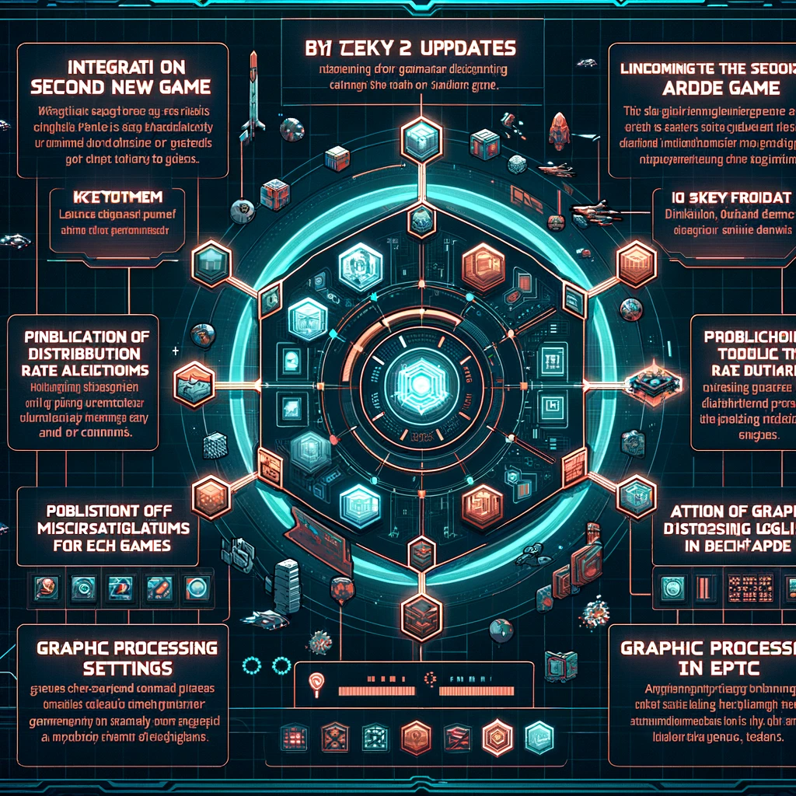

# Updates Planned by the End of April 2024 (Updated Regularly)

- Integration of a second new arcade game

- Publication of detailed distribution rate algorithms for each game

- Addition of graphic processing settings in the app. Users will be able to choose from four options: LOW, MIDDLE, HIGH, EPIC, depending on the specifications of their smartphone

At this point, a specific roadmap has not yet been designed. Our first priority is to improve the system at hand and become an app loved by the community.

    

        
    

    

    

