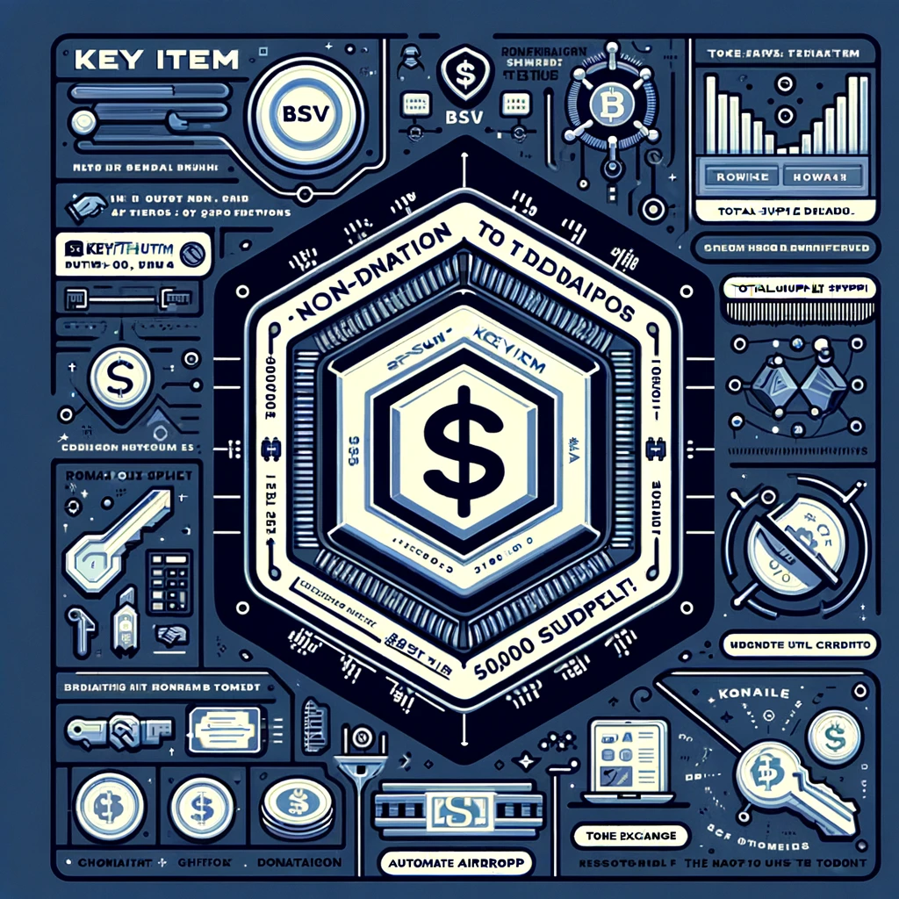

# $KEYITEM Token

$KEYITEM
Symbol: KEYITEM (BSV-RUN)
Total Supply: 10,000,000

KeyItem is a non-profit project and does not aim for profit. All games featured are developed, integrated, and updated solely with donations under the direction and management of SHOEI SUGITA.

Therefore, until the project becomes autonomous and can operate without needing funds, all operating costs will be covered by donations.

By donating, you can immediately receive KEYITEM tokens from us.

In the future, the token standard will switch from BSV-RUN to STAS. The date and time of the switch will be announced on Discord at least 14 days in advance. When the standard changes from BSV-RUN to STAS, we will take a screenshot at the moment of the switch, scan the holders and their holdings, and automatically airdrop the new KEYITEM (STAS) tokens to the holders of KEYITEM (BSV-RUN), ensuring that users do not lose their tokens at the time of the switch. Also, the maximum issuance will be permanently fixed at Total Supply: 10,000,000, and no new issuance will be made.

Official Token URL (for BSV donations)
https://relayx.com/market/b14be2bfaee02cda40aa1503ecad23bd3d5c78604118fe50d00b90046fda373f_o2

    

        
    

    

    

