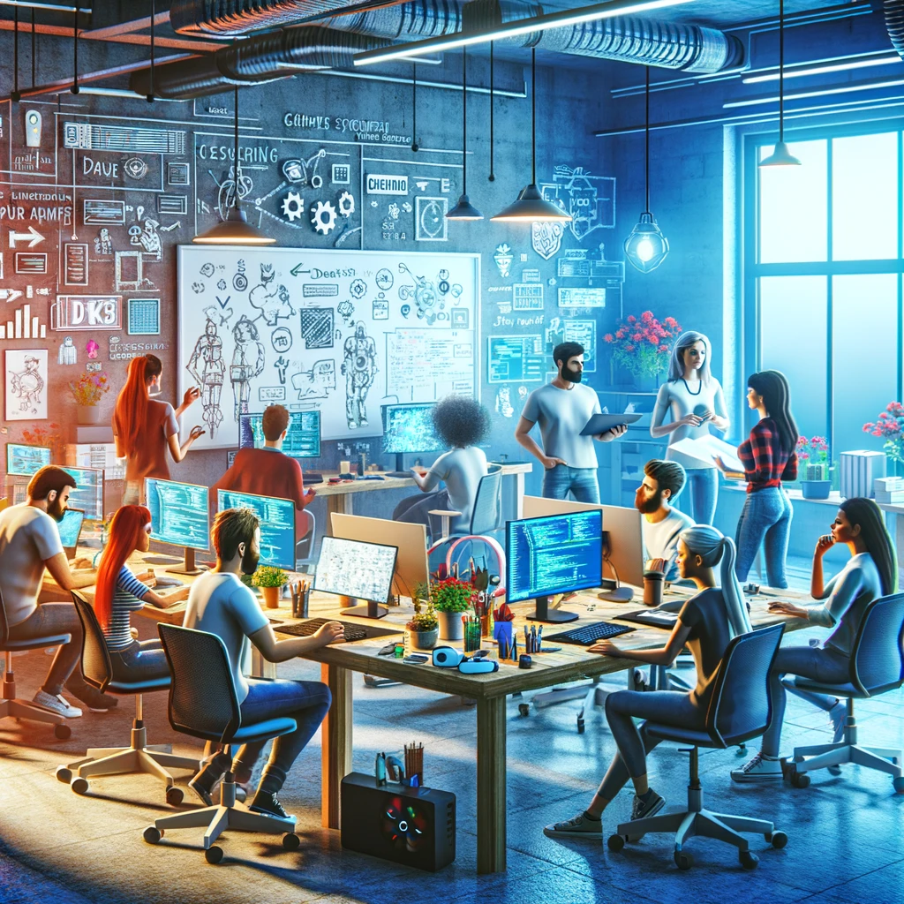

# Desarrollo y Integración de Juegos

Si eres un ingeniero de UE con un juego especial, puedes integrarlo en KeyItem. Desarrollar un juego con alguien puede llevar a algo más allá de tu imaginación. Es un evento emocionante, esencial para nosotros los creadores. Si eres un ingeniero de UnrealEngine, puedes tener la oportunidad de integrar tu mini-juego desarrollado en KeyItem proporcionándome el archivo del proyecto del juego.

Alternativamente, puedes conectar directamente tu juego a la economía de KEYITEM utilizando el protocolo de KEYITEM planificado.

Si tu juego desarrollado está conectado a KEYITEM, podrás obtener una recompensa del 5% de la economía generada por ese juego.

Cuantos más juegos atractivos reunamos, más activa se volverá la comunidad de KeyItem y mayor será el valor que circule en la economía de KeyItem. Una parte del BSV reunido se utilizará cuidadosamente para la paz mundial.

Nuestro objetivo es una relación Win-Win sostenible para desarrolladores, jugadores y la sociedad.

    

        
    

    

    

