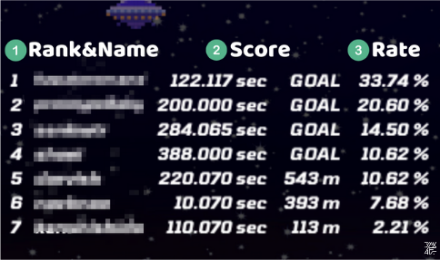
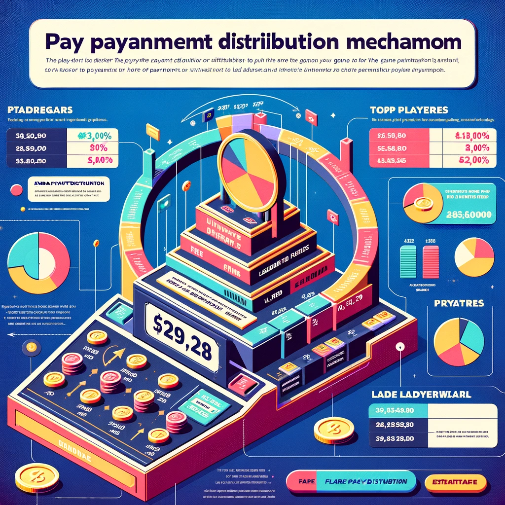

# プレイ料金の仕組み

プレイヤーの支払ったアーケードゲームのプレイ料金は、そのゲームのリーダーボードに分配される仕組みになっています。

例）Dragotchi Parkour Raceのリーダーボード

    

        
    

    

    

例えば、Aliceの分配率が33.74%だった場合、
誰かがプレイすると、支払われたプレイ料金1USDのうちの、約0.3374USDがAliceのウォレットに送金されます。

Dragotchiレースの分配率を決めるアルゴリズムは、
GOALできなかったユーザーの中で最も一番遠くまで走れたプレイヤーの分配率が、
GOALしたユーザーの中で最も遅いタイムの人の分配率の半分の分配率になるよう基準を設定し、
スコアの良さ（GOALしたプレイヤー同士はタイムの速さ、GOALできなかったプレイヤー同士は走れた距離）に比例するよう分配率が決定しています。

ランキングは原則リセットされません。リセットを行う場合は14日間以上前にDiscordにて通知をします。
ゲームごとに分配率が決定するアルゴリズムは様々ですが、なるべく公平なアルゴリズムを考案・採用しています。
また、ゲームの分配率決定のアルゴリズムの詳細は、アルゴリズムセクションにて整理して公開する予定です。

    

        
    

    

    

