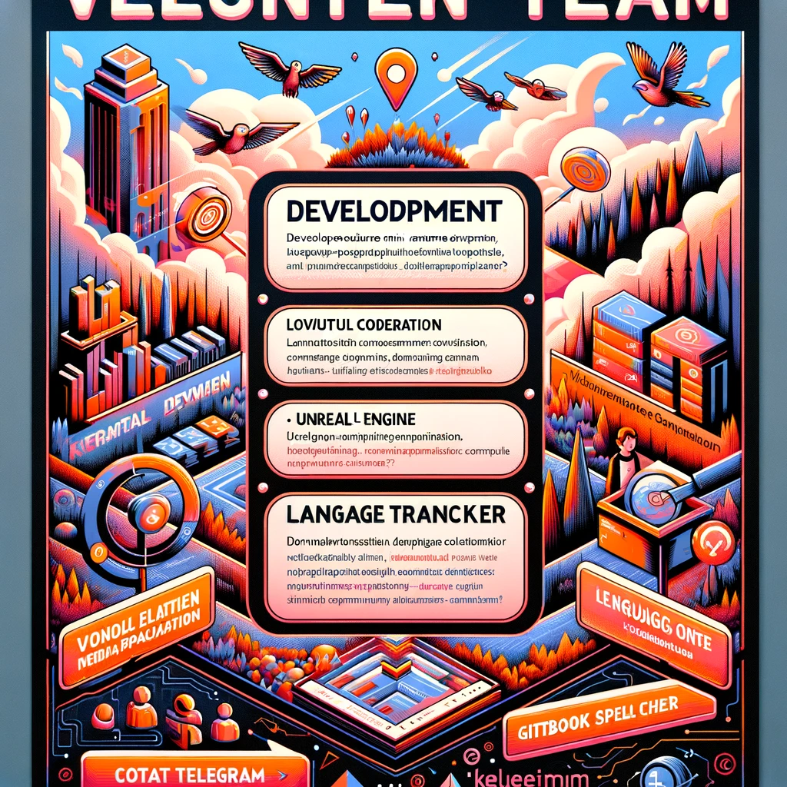

# 運営メンバーの募集

現在KeyItemのチームは、ボランティアによって結成され、サービスを開発しています。

募集ポジション
-開発に協力してくださる方（UnrealEngineでのミニゲーム開発、webアプリケーション開発)
-各言語のgitbookの文章のスペルチェックをしてくれる方

よければご連絡くださいませ。

Telegram
https://t.me/+ZYYQN7AICnVhNDI1

    

        
    

    

    

