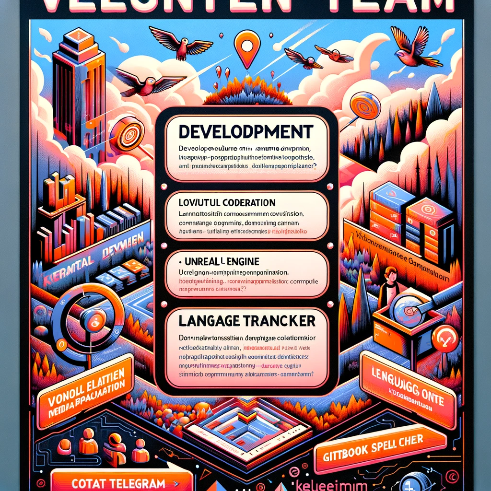

# 招募运营团队成员

目前，KeyItem团队由志愿者组成，并正在开发服务。

招募职位：
- 愿意协助开发的人员（UnrealEngine迷你游戏开发、Web应用程序开发）
- 能够对各种语言的GitBook文档进行拼写检查的人员

如果您有兴趣，请随时与我们联系。

Telegram
https://t.me/+ZYYQN7AICnVhNDI1

    

        
    

    

    

